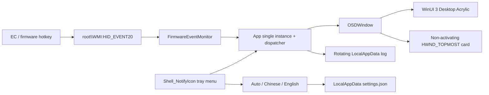

# Architecture

## Components

| File | Responsibility |
|---|---|
| `App.xaml.cs` | Single instance, `--demo`/`--stop`, watcher lifetime, shutdown |
| `FirmwareEventMonitor.cs` | `HID_EVENT20` subscription, byte parsing, rotating log |
| `OSDWindow.xaml(.cs)` | Card UI, Acrylic, mapping, animation, positioning, topmost styles |
| `Localization.cs` | English/Chinese resources, system-language detection, settings |
| `TrayIcon.cs` | `Shell_NotifyIcon`, fixed menu commands, executable icon extraction |
| `app.manifest` | `asInvoker`, `uiAccess=false`, PerMonitorV2 DPI awareness |

The tray callback window and native menu run on a dedicated STA/message-pump thread. Menu selections are marshalled to the WinUI dispatcher, so a modal tray menu cannot delay firmware-event cards. Duplicate tray callbacks are ignored while a menu is already open.

The OSD uses `WS_EX_TOPMOST | WS_EX_TRANSPARENT | WS_EX_TOOLWINDOW | WS_EX_NOACTIVATE` and `SetWindowPos(HWND_TOPMOST, ... SWP_NOACTIVATE)`. It therefore stays above ordinary windows without taking keyboard focus or mouse input.
