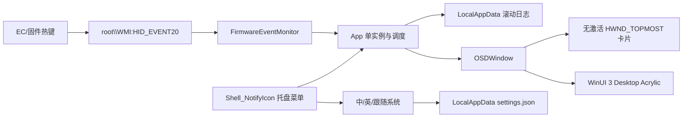

# 架构说明

## 数据流

## 主要文件

| 文件 | 责任 |
|---|---|
| `App.xaml.cs` | 单实例、`--demo`/`--stop`、WMI 监听生命周期和退出 |
| `FirmwareEventMonitor.cs` | 订阅 `HID_EVENT20`、解析 `EventDetail`、滚动日志 |
| `OSDWindow.xaml` | OSD 卡片的 WinUI 3 视觉树 |
| `OSDWindow.xaml.cs` | Acrylic、事件映射、动画、屏幕定位和置顶窗口样式 |
| `Localization.cs` | 中文/英文字符串、系统语言检测和设置持久化 |
| `TrayIcon.cs` | `Shell_NotifyIcon`、固定托盘命令和 EXE 图标提取 |
| `app.manifest` | `asInvoker`、`uiAccess=false`、PerMonitorV2 DPI |

## 窗口行为

OSD 使用 `WS_EX_TOPMOST | WS_EX_TRANSPARENT | WS_EX_TOOLWINDOW | WS_EX_NOACTIVATE`，并通过 `SetWindowPos(HWND_TOPMOST, ... SWP_NOACTIVATE)` 显示。它不会抢走当前应用焦点，也不会接收鼠标输入，但能覆盖普通窗口。

Desktop Acrylic 使用 `DesktopAcrylicController` 的 Thin 模式。系统不支持或控制器注册失败时，窗口回退到固定颜色，不影响事件监听。

## 单实例

程序使用当前会话下的 `Local\MechrevoCustomOSD` mutex。后续 `--demo` 和 `--stop` 实例只负责发送命名事件，然后立即退出。
